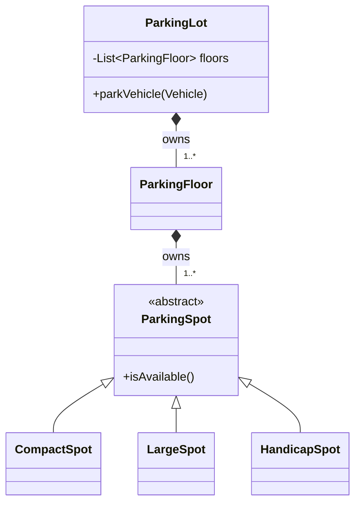

# UML & Code Quality

UML gives you a shared **visual language** for class relationships. The three code-quality principles (DRY, KISS, YAGNI) give you a **vocabulary for restraint** — they tell you when to *stop* designing.

## Why it matters

In an LLD interview, you'll sketch class diagrams on a whiteboard. Knowing the standard UML notation lets you communicate "ParkingLot HAS-A floors, floors HAS-A spots, Vehicle IS-A abstract type" without paragraphs of prose. The interviewer reads it at a glance.

DRY/KISS/YAGNI exist because the most common mistake in design is **over-design**: building abstractions for problems that don't exist yet, adding hooks "just in case", and turning 50 lines of clear code into 300 lines of indirection. These three principles are guardrails.

## Core concepts

### UML class diagram relationships

| Relationship | Notation | Meaning | Example |
|--------------|----------|---------|---------|
| **Inheritance** | Empty triangle, solid line | IS-A (extends) | `Car ▷ Vehicle` |
| **Implementation** | Empty triangle, dashed line | implements interface | `Car ▷-- PaymentProcessor` |
| **Association** | Solid line | "uses" / "knows about" | `Order — Customer` |
| **Aggregation** | Hollow diamond | HAS-A, weak (part can exist without whole) | `Team ◇— Player` |
| **Composition** | Filled diamond | HAS-A, strong (owner owns the part's lifetime) | `House ◆— Room` |
| **Dependency** | Dashed arrow | uses temporarily (parameter, local var) | `OrderService ⤏ Logger` |

#### Inheritance (IS-A)

```text
Vehicle  (abstract)
   △
   │
   ├── Car
   ├── Motorcycle
   └── Truck
```

In code: `class Car extends Vehicle`. Use sparingly — see [OOP](oop.md) on composition vs inheritance.

#### Implementation

```text
PaymentStrategy  «interface»
   △
   ┊
   ├── CreditCardPayment
   ├── PayPalPayment
   └── UPIPayment
```

In code: `class CreditCardPayment implements PaymentStrategy`. The dashed line distinguishes interface implementation from class inheritance.

#### Aggregation vs Composition

These two trip people up. The difference is **ownership** and **lifetime**.

- **Aggregation** (hollow diamond): the whole and the part have independent lifetimes. Deleting the whole does not delete the part.
  - `University ◇— Professor` — if the university closes, the professor still exists (and might join another university).
- **Composition** (filled diamond): the part's lifetime is bound to the whole. When the whole is destroyed, so is the part.
  - `House ◆— Room` — if you demolish the house, the rooms cease to exist as discrete entities.

In Java, the difference is usually whether the "part" was constructed inside the "whole" and is held in a private final field (composition) versus passed in from outside (aggregation).

#### Association vs Dependency

- **Association**: a long-term relationship, typically a field. `Order` has a field `customer`.
- **Dependency**: a transient relationship, typically a method parameter or local variable. `OrderService.process(Logger logger)` depends on `Logger` but doesn't *hold* one.

#### Multiplicity

Numbers next to lines describe how many participate:

```text
Order ──1..*── LineItem      # 1 Order has 1 or more LineItems
Customer ──1── Cart          # 1 Customer has exactly 1 Cart
Cart ──0..*── Product        # Cart has 0 or more Products
```

### A worked example: Parking Lot UML

```text
                ┌──────────────┐
                │  ParkingLot  │ «Singleton»
                └──────┬───────┘
                       │ 1
                       ◆
                       │ 1..*
                ┌──────▼──────┐
                │ ParkingFloor│
                └──────┬──────┘
                       │ 1
                       ◆
                       │ 1..*
                ┌──────▼──────┐
                │ ParkingSpot │ «abstract»
                └──────△──────┘
                       │
        ┌──────────────┼──────────────┐
        │              │              │
 ┌──────┴─────┐ ┌──────┴─────┐ ┌──────┴────────┐
 │ CompactSpot│ │ LargeSpot  │ │ HandicapSpot  │
 └────────────┘ └────────────┘ └───────────────┘

ParkingLot ──1── PaymentStrategy «interface»
                        △
                        ┊
            ┌───────────┼───────────┐
        CreditCard    Cash       UPI
```

Read this as: *"one ParkingLot owns (composition) 1..n ParkingFloors; each floor owns 1..n abstract ParkingSpots; concrete spot types extend the abstract base; the lot also has-a PaymentStrategy implemented by concrete payment classes."* Every other LLD sketch follows the same shape.

### Mermaid syntax (for digital diagrams)

Mermaid renders nicely in Markdown. The same parking lot:



## Code quality principles

### DRY — Don't Repeat Yourself

**Principle**: Every piece of *knowledge* should have a single, unambiguous representation in the codebase.

```java
// BAD: tax rate hardcoded in three places.
class Cart {
    double subtotal() { /* ... */ return 0; }
    double total() { return subtotal() * 1.18; }
}
class Invoice {
    double total(double subtotal) { return subtotal * 1.18; }
}
class Quote {
    double total(double subtotal) { return subtotal * 1.18; }
}
// Tax goes to 1.20? Three places to update. One missed = production bug.

// GOOD: single source of truth.
class TaxPolicy {
    static final double GST = 1.18;
    static double withTax(double subtotal) { return subtotal * GST; }
}
```

**The nuance**: DRY is about *knowledge*, not surface similarity. Two methods that look identical but represent different *concepts* (one is "validate user input", another is "validate config file") should *not* be merged just because they currently look the same — they will evolve differently.

!!! warning "Premature DRY is wrong DRY"
    Don't extract a helper the first time you see two similar lines. Wait for the third occurrence. Two pieces of code that look similar today might diverge tomorrow, and a too-eager extraction makes that divergence painful.

### KISS — Keep It Simple, Stupid

**Principle**: Simplicity is a primary design goal. Avoid unnecessary complexity.

- The simplest design that meets the requirements is usually the best.
- Don't introduce abstractions, frameworks, or patterns "just in case".
- If a junior on the team can't read your code without three asks, it's too clever.

**Concrete examples**:

- A `for` loop is simpler than a stream chain when the loop is 3 lines.
- A `Map<String, Handler>` lookup is simpler than a 7-class Strategy + Factory + Singleton dance when you have 3 handlers.
- A plain method is simpler than `class XAction implements Command` when there's no undo.

KISS is the principle that pushes back against over-engineering. Whenever you add a layer of indirection, ask: *does the value exceed the cost?*

### YAGNI — You Aren't Gonna Need It

**Principle**: Don't add functionality until it is actually needed.

- Don't build for hypothetical future requirements.
- Don't add a "pluggable backend" when you have one backend.
- Don't add config options "in case someone wants to tune it" — wait for someone to ask.

```java
// BAD: imagined future requirements baked in.
class UserService {
    public UserService(
        Database db,
        Cache cache,
        AuditLog audit,
        MetricsCollector metrics,
        FeatureFlagsClient flags,
        // ... eight more dependencies we "might need" ...
    ) { /* ... */ }
}

// GOOD: build for today. Add dependencies when the feature lands.
class UserService {
    public UserService(Database db) { /* ... */ }
}
```

**Why YAGNI matters**: every "just in case" feature is code you must maintain, test, and reason about *forever*, in exchange for value you might never realize. Most of the future you imagine doesn't happen — and the future that does happen is rarely what you imagined.

## When to use which principle

| Situation | Principle to invoke |
|-----------|--------------------|
| Same business rule appearing in 3+ places | **DRY** — extract a single source of truth. |
| Code is "clever" or hard to follow | **KISS** — prefer the boring obvious version. |
| Tempted to add an extension point with no concrete consumer | **YAGNI** — wait for a real need. |
| Tempted to merge two similar but conceptually distinct chunks | Pause — DRY may be wrong here. |

## Common pitfalls

- **Diagrams nobody reads** — UML is for communication, not documentation theatre. A 200-class enterprise diagram is unreadable. Keep diagrams focused: one diagram per concept.
- **Inheritance arrows everywhere** — students new to UML overuse the inheritance triangle. Most relationships in real code are composition/aggregation, not inheritance.
- **DRY-induced coupling** — extracting "the same code" from two unrelated modules into a shared helper couples those modules forever. Sometimes duplication is genuinely cheaper than the wrong abstraction.
- **KISS as an excuse for hackery** — "I kept it simple" is not a defense for skipping error handling or input validation. Simple ≠ careless.
- **YAGNI taken to dogma** — there are extension points worth building today (e.g., a payment processor interface in an e-commerce app — you *will* add another provider). YAGNI is about *speculative* features, not *foundational* design.
- **Confusing aggregation and composition** — in interviews, get this right. If asked "is `Engine` part of `Car`?", the answer affects lifetime, ownership, and whether `Engine` can outlive a `Car`.

## Linked problems

Every LLD problem benefits from a UML sketch and disciplined application of DRY/KISS/YAGNI, but these are particularly diagram-heavy:

- [Parking Lot](../problems/parking-lot.md) — classic composition hierarchy (Lot → Floor → Spot).
- [File System](../problems/file-system.md) — recursive composite hierarchy.
- [Chess Game](../problems/chess.md) — abstract `Piece` with six concrete subclasses.
- [Hotel Booking](../problems/hotel-booking.md) — room-type hierarchy plus strategy injection.
- [Online Shopping](../problems/online-shopping.md) — large enough to benefit from multiple focused diagrams.
